<div align="center">

# Craftbyte Studio — Company Profile Website

</div>

A multi-page company profile website built with Laravel's MVC architecture as part of ITST 302 (Client-Server Technologies), Week 3 Mini Project.

**Student:** Patrick John M. Goco<br>
**Course:** ITST 302 – Client-Server Technologies<br>
**Section:** BSIT 3D<br>
**Repository:** [week03-company-profile](https://github.com/Snowden199x/week03-company-profile)

---

## Introduction

A company profile website is the first thing most people check when they want to know if a business is legitimate. It usually covers who the company is, what they offer, and how to reach them, all in one place instead of scattered across social media pages. For a startup especially, having this online presence matters early on, since it's often the deciding factor for a potential client choosing between a real company and just another freelancer.

This project simulates that exact scenario. Acting as a newly hired Junior Laravel Developer, the task was to build a company profile website for a fictional startup called **Craftbyte Studio**, an app development studio, using Laravel's MVC architecture with proper routing, controller logic, and reusable Blade templates.

Beyond the website itself, the purpose of this project is to get hands-on practice with how Laravel actually processes a request from start to finish, and to build something that could realistically sit in a developer's portfolio.

## Objectives

By completing this project, the following objectives were accomplished:

- Built a working Laravel application following the MVC architecture
- Set up four application routes (Home, About, Services, Contact) using Laravel Routing
- Created a `CompanyController` to handle all page requests
- Built reusable Blade layouts and components (navbar, footer) instead of duplicating code across pages
- Designed a fully responsive interface using Tailwind CSS
- Practiced Git version control with meaningful, incremental commits
- Documented the entire development process in this README

## MVC Architecture

**MVC** stands for Model-View-Controller. It's a way of organizing an application by splitting it into three separate responsibilities instead of cramming everything into one file.

- **Model** handles the data and the logic around it, like talking to the database
- **View** is what the user actually sees, the HTML and layout
- **Controller** sits in between, it receives the request, decides what needs to happen, and passes the right data to the view

Laravel uses MVC because it keeps the codebase manageable as a project grows. Without this separation, a single file would end up handling database queries, business logic, and HTML all at once, which becomes painful to maintain or debug once the app gets bigger than a few pages.

The advantages become obvious once you've worked on a messier codebase. Changes to how a page looks don't risk breaking the logic that fetches the data. Multiple developers can work on different layers without stepping on each other's code. And testing gets easier, since the logic isn't tangled up with the presentation.

Here's how a request flows through this application:

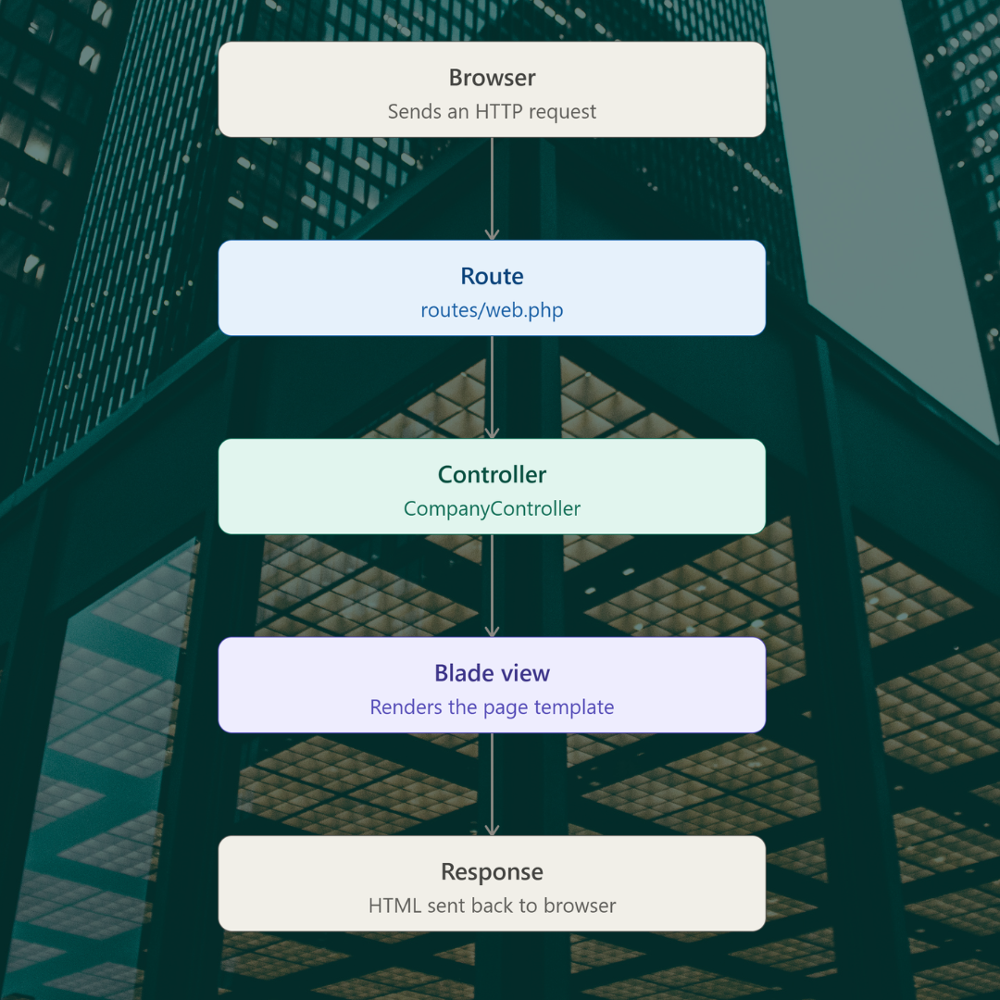
## Laravel Routing

Routing is how Laravel decides what code should run when someone visits a specific URL. Instead of a browser directly pointing to a PHP file the way old-school PHP sites worked, every request in Laravel first passes through `routes/web.php`, where it gets matched against a defined path.

**GET Requests** are used here since all four pages are just displaying content, no form submissions are being processed yet (the contact form is UI only for this project).

**Route Definitions** used in this project:

```php
use App\Http\Controllers\CompanyController;

Route::get('/', [CompanyController::class, 'home']);
Route::get('/about', [CompanyController::class, 'about']);
Route::get('/services', [CompanyController::class, 'services']);
Route::get('/contact', [CompanyController::class, 'contact']);
```

Each route maps a URL path to a specific method inside `CompanyController`. When someone visits `/about`, Laravel calls the `about()` method, which returns the `about` Blade view.

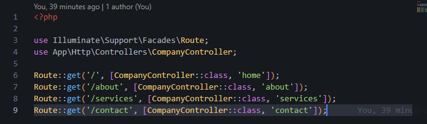

## Controllers

A controller's job is to group related request-handling logic into one class instead of writing it directly inside the routes file. For a small project like this one, it might not seem necessary, but it becomes essential once an app has more than a handful of pages, or once those pages need to pull data from a database.

`CompanyController` was created using:

```bash
php artisan make:controller CompanyController
```

It contains four methods, one for each page:

```php
class CompanyController extends Controller
{
    public function home()
    {
        return view('pages.home');
    }

    public function about()
    {
        return view('pages.about');
    }

    public function services()
    {
        return view('pages.services');
    }

    public function contact()
    {
        return view('pages.contact');
    }
}
```

The benefit here is separation of concerns again, the controller doesn't care what the HTML looks like, it just decides which view to hand back to the browser.

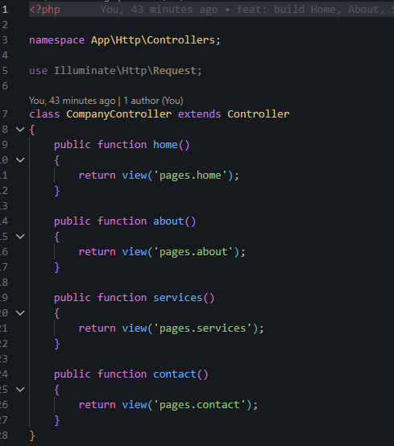

## Blade Templating Engine

Blade is Laravel's built-in templating engine. It lets you write plain HTML mixed with lightweight PHP-like syntax, without the clutter of writing `<?php echo ?>` everywhere.

**Blade Layouts** define a shared page structure that other views can plug into. This project uses `layouts/app.blade.php` as the master layout:

```blade
<!DOCTYPE html>
<html lang="en">
<head>
    <title>@yield('title', 'Company Profile')</title>
</head>
<body>
    @include('components.navbar')
    <main>
        @yield('content')
    </main>
    @include('components.footer')
</body>
</html>
```

**Blade Components** are the reusable pieces, in this project that means `navbar.blade.php` and `footer.blade.php`, pulled into the layout with `@include`.

The key directives used throughout this project:

| Directive | Purpose |
|---|---|
| `@extends` | Tells a page which layout to inherit |
| `@section` | Defines a named block of content (like `title` or `content`) |
| `@yield` | Marks where a section's content should be injected in the layout |
| `@include` | Pulls in a reusable component, like the navbar or footer |

Example from `pages/home.blade.php`:

```blade
@extends('layouts.app')

@section('title', 'Craftbyte Studio - App Development')

@section('content')
    <!-- page content here -->
@endsection
```
### Blade Layout (`layouts/app.blade.php`)

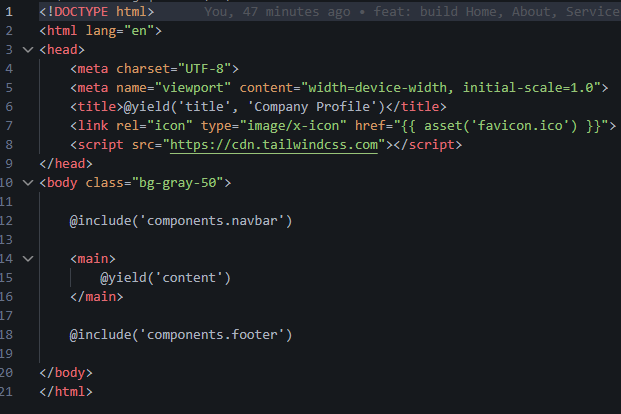

### Sample Page (`pages/home.blade.php`)

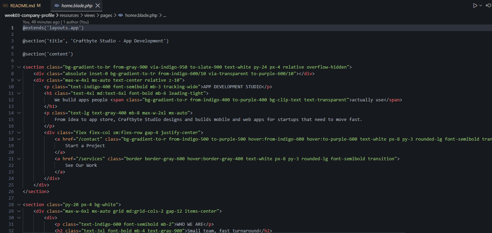

## Laravel Folder Structure

| Folder | Purpose |
|---|---|
| `app/` | Contains the core application code, including controllers, models, and providers |
| `routes/` | Holds route definition files like `web.php`, which map URLs to controllers |
| `resources/` | Contains views (Blade templates), raw CSS, and JavaScript before compilation |
| `public/` | The web-accessible entry point of the app, includes `index.php`, images, and compiled assets |
| `bootstrap/` | Files that bootstrap the framework and cache framework-generated files |
| `config/` | Configuration files for the application, database, mail, and other services |

## Screenshots

### Homepage
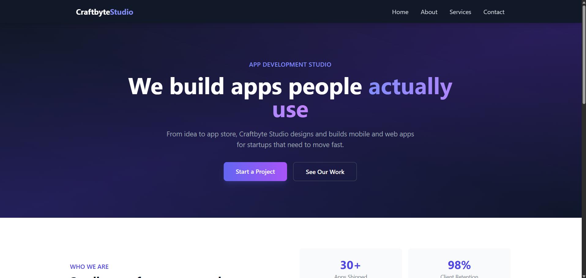

### About Page
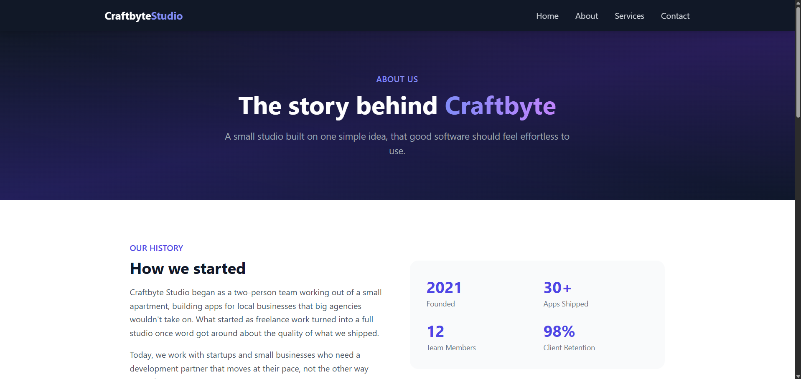

### Services Page
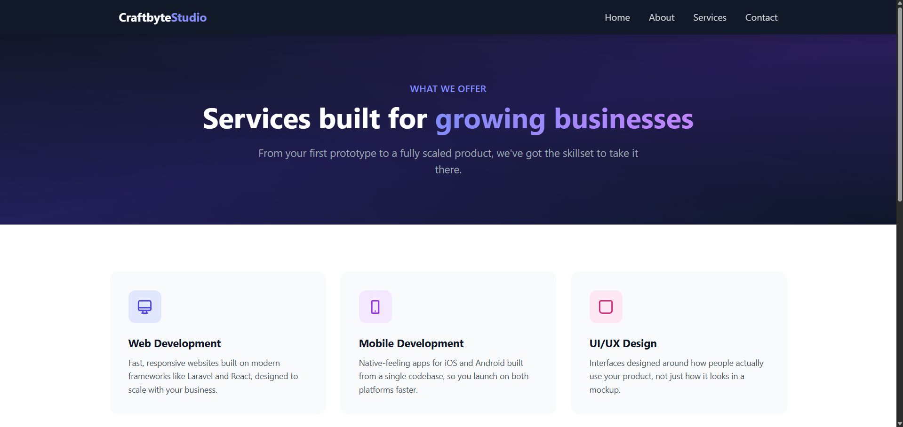

### Contact Page
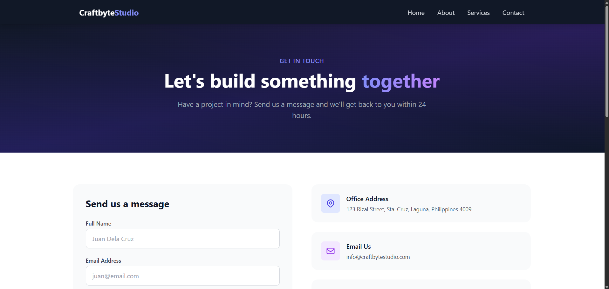

### Navigation Bar


### Footer


### VS Code Project Structure
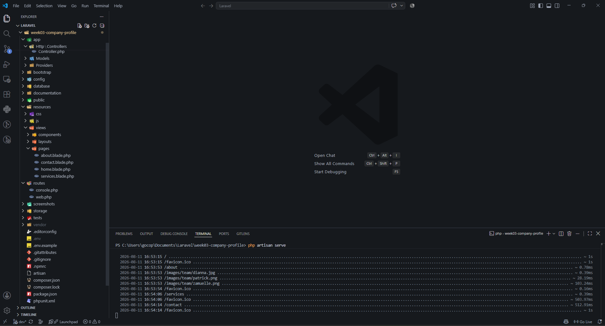

### Laravel Folder Structure
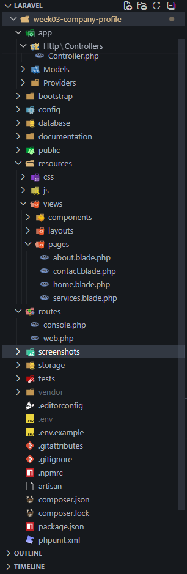

### Browser Output
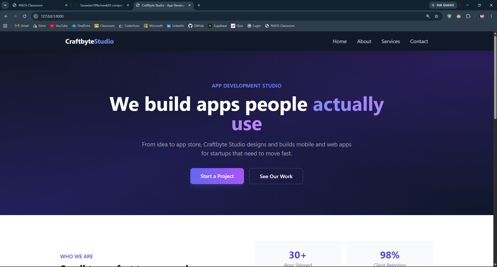

### GitHub Repository
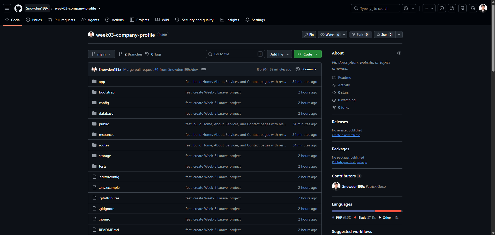

## Problems Encountered

**1. Composer refused to install into the project folder**

Running `composer create-project laravel/laravel .` initially failed with a "Project directory is not empty" error, even though the folder looked empty in File Explorer. The Laravel project also ended up nested inside an extra `laravel/` subfolder at one point after re-running the command incorrectly.

**2. Hidden `.git` folder blocking installation**

Even after clearing out visible files, Composer still refused to install. The folder had a hidden `.git` directory left over from an earlier `git init`, which was invisible in a normal `dir` listing.

**3. SQLite driver not found**

After the project was finally set up, running any database command triggered `could not find driver (Connection: sqlite)`. The default PHP installation had the SQLite extensions disabled.

**4. "No such table: sessions" error**

After fixing the driver issue, the app still threw a database error on page load, this time because the required tables, including the default `sessions` table, hadn't been created yet.

**5. GitHub push failing with "repository not found"**

After deleting and recreating the GitHub repository, `git push` failed since the remote origin URL was pointing to a repository that no longer matched what existed on GitHub, and a duplicate `remote add` attempt caused an "already exists" error.

## Solutions

**1.** Used `Get-ChildItem -Force` in PowerShell to reveal hidden files, since the default `dir` command doesn't show them. This confirmed the folder wasn't truly empty.

**2.** Temporarily moved the `.git` folder out of the project directory using `Move-Item`, ran `composer create-project laravel/laravel .` on the now-empty folder, then moved `.git` back in afterward.

**3.** Located the active `php.ini` file using `php --ini`, then uncommented the `extension=pdo_sqlite` and `extension=sqlite3` lines by removing the leading semicolons. Restarted the terminal so PHP would reload the updated configuration.

**4.** Ran `php artisan migrate` to generate the missing default tables, including `sessions`, `users`, and `cache`.

**5.** Removed the outdated remote reference with `git remote remove origin`, then re-added it pointing to the correct, freshly created GitHub repository before pushing again.

## Reflection

Going into this project, I already had a rough idea of what MVC meant in theory, but actually building something with it made the concept click in a way that reading about it never did. Before this, my instinct when starting a new page was just to throw everything into one file, HTML, logic, all of it together. Working with Laravel forced a different habit. The controller only cares about which view to return, the view only cares about displaying what it's given, and the routes file only cares about matching a URL to the right controller method. Once I stopped fighting that separation and just let each piece do its one job, the whole project felt less tangled than anything I'd built before.

Separation of concerns matters more than I expected going in. With `CompanyController` handling all four pages, I could redesign the entire homepage, gradients, mascot section, all of it, without touching a single route or worrying that I'd break the About page in the process. That's not something I appreciated until I actually had four separate pages sharing the same navbar and footer components. Changing the footer once in `footer.blade.php` updated it everywhere instantly, instead of me having to hunt down and edit four different copies of the same code.

Seeing how routes, controllers, and views work together also cleared up something that used to feel like a black box. A request comes in, the route matches it to a controller method, the controller decides what to return, and the view renders it back out. Once I traced that flow manually while debugging the sessions table error, I understood Laravel's request lifecycle far better than any diagram alone could have taught me. Debugging real errors, like the SQLite driver issue or the git conflicts before I even got the project running, ended up teaching me just as much as the actual coding did.

As for applying this to larger enterprise systems, I can see how this same structure scales. A real company wouldn't have four static pages, it would have hundreds of routes, dozens of controllers, and views pulling from actual databases instead of hardcoded content. But the underlying principle stays the same: keep logic, data, and presentation separated so that a team of developers can work on different parts of the same application without constantly colliding with each other's code. That's the part of MVC that feels less like a Laravel-specific rule and more like a general lesson in how to write software that doesn't collapse under its own weight as it grows.

## References

Laravel. (2025). *Laravel 11.x documentation*. https://laravel.com/docs

The PHP Group. (2025). *PHP manual*. https://www.php.net/manual/en/

Mozilla Developer Network. (2025). *MDN web docs*. https://developer.mozilla.org/

Tailwind Labs. (2025). *Tailwind CSS documentation*. https://tailwindcss.com/docs